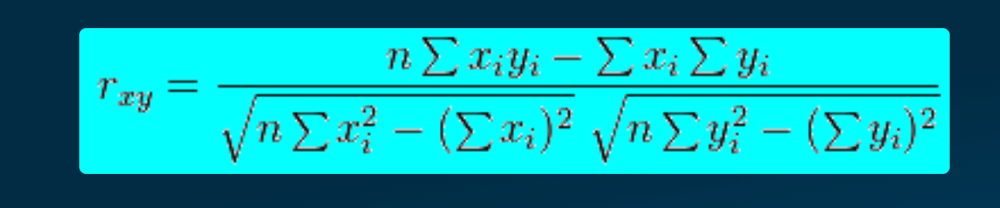
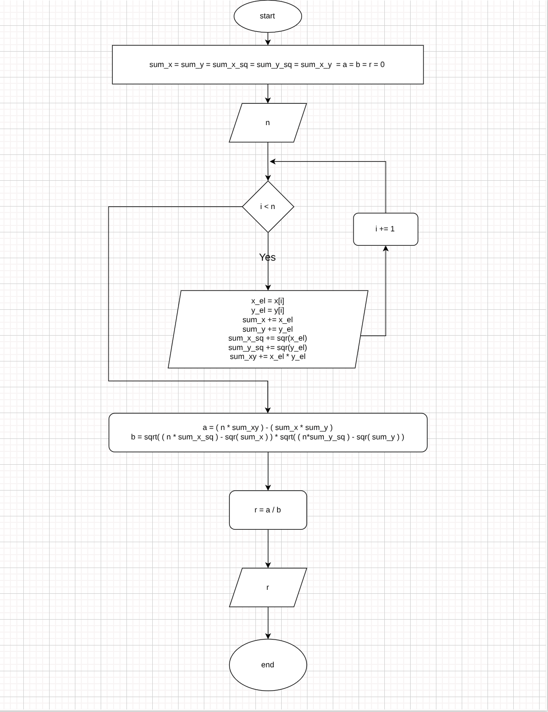

# Correlation
### Formula:

#### Input:
- **n**, **x** and **y**
#### processes
1. get number of items **n**
2. get the values of items of **x** and **y**
3. calculate the following vars for each item in loop:
    - sum_x += x[i]
    - sum_y += y[i]
    - sum_x_sq += sqr(x[i])
    - sum_y_sq += sqr(y[i])
    - sum_xy += x[i] * y[i]
4. calculate ((n*sum_xy)-(sum_x * sum_y)) as **a**
5. calculate sqrt((n * sum_x_sq) - sqr(sum_x)) * sqrt((n * sum_y_sq) - sqr(sum_y)) as **b**
6. **r** = **a** / **b**
7. print **r**
#### output
- **r**

### Correlation Algorithm Model

